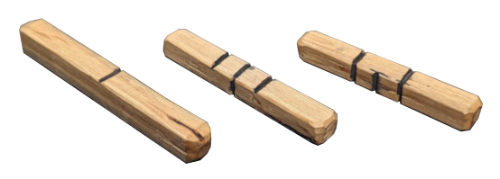

# Makeshift Basic RPG
aka MBR aka "**Ember**"

### Why this RPG exists

For many years, I've been learning to live off the land.  One thing that was in the back of my mind for a long time was, "How do I keep myself entertained?" I noticed while watching the TV show, "Alone", that this was also an issue with the contestants.

I decided to design a solo RPG with rules simple enough to memorize, does not need any information written down, and used some type of "oracle" to aid in story creation.

This is that RPG. It's not for everyone and it's not designed to replace an RPG you might play in the comfort of your home. It's designed to be a form of entertainment that you can create with nothing but sticks and stones. (and a knife, if you have one)

## Summary (TL;DR)

All PCs and high level NPCs have **CON**, **STR**, **DEX**, and **INT**. Lesser creatures and objects only have **LVL**. PCs get a pile of tokens per trait and another for HP that can be spent shifting the dice rolls. **HP** can be spent in place of any other trait.

You get **20 + level** points to divide between your traits as desired, an average of **5** points per trait at level **0**.

Your **HP** = **CON** + **level**.

PCs also get a *narrative background* that will either add **1** point to a trait at relevant times, or add a new skill, such as a specific type of magic.

On your turn, you get **2** actions, **1** can be an attack. You can spend **DEX** to get extra actions.

Calculate the **DIF** by starting at **5** (**50%**) and comparing the *remaining tokens* for the trait used to the level of the challenge. For every **2** points over or under, add or subtract **1** to or from the **DIF**. Use a **d4** die, numbered **0**-**3**, rolled **3** times to match or beat the **DIF**. If you roll a **9**, roll again and add the result.

For every **2** points over the **DIF** rolled in an attack, do **1** extra point of damage.

Attack with **STR**, defend with **DEX**. Ranged attacks take **2** actions. Saves for conditions are rolled with **CON**.

Magic spends **INT** to charge **manna** with dice rolls. One roll per token spent. The result is the approximate damage, protection, or healing done by the spell.

Healing has a **manna** cost equal to the amount of **HP** to heal. A resurrection costs as much as the **max HP** of the target, but revives with **1 HP**.

A summons has its cost split between its **LVL**/**HP** and the **damage** its capable of.

You get **1** *short rest* between battles, and **1** *long rest* at the end of the in-game day. *Short rests* recover **non-HP** tokens.  *Long rests* recover **all** tokens not used for long running spells.

*Long running spells*, such as summons, don't regenerate the tokens spent on it until the spell ends.  After **2** *consecutive long rests* without using any magic between them, the tokens spent will regenerate.

### The Rules

These rules are designed to be the foundation of a game, but there's always situations where you will need to use your best judgment. This is known as, "rulings over rules".

For example, I want to grab an orc and throw him over a cliff. There's no specific rule for this, but I can make the judgment that it would be a **STR** vs **STR** challenge.

If you have the resources, these rules can be expanded on with supplemental material. For example, specific monster stats, or a set list of weapons, skills, or spells.

### A Brief Explanation of Traits and Tokens

Your character has traits that are assigned a value. You will use tokens to indicate the current value of the trait. You can spend tokens to shift the value of the dice rolls, as well as other actions, such as magic. Spending tokens will cause the value of that trait to decrease until you can rest.

The number you need to match with a dice roll is determined by the difference between the difficulty of the challenge and your character's current value for the relevant trait.

### Character Stats

Your character has a small set of traits: Constitution (**CON**), Strength (**STR**), Dexterity (**DEX**), and Intelligence (**INT**). These traits correlate to the 4 sides of the die. (See notes on the Oracle die)

Your **CON** is how healthy you are and how well you resist conditions, such as poison. It is also added to your level to determine how many Hit Points (**HP**) you have, or how much damage you can take before dying. If you spend **CON**, this limits your max **HP** until it recovers. **CON** is also an indicator of how attractive you are.

Your **STR** is how hard you hit, or how much weight you can lift.

Your **DEX** is how fast or nimble you are, how easily you can dodge an attack.

And lastly, your **INT** is how smart you are. How skilled you are at fighting. How well you can resist mental attacks. And, if you choose to use magic, how powerful your spells are.

You'll also want to add a pile of tokens for your **HP**. Each token removed from this pile represents damage your PC takes.

A brand new character will start at level **1** with **21** points (**20 + level**) to distribute between your traits as desired.

You also add a *narrative background* to your character. What they did before going on this adventure, as well as their personality. You use this *background* to add **1** point to any trait that is relevant to the current challenge.

So, for example, if your *background* is, "*I was a used cart salesman*", you could add **1** to **INT** when trying to convince someone to join your side in a fight. If you're unable to write it down, you should try to keep the *background* simple enough to memorize.

If you can do magic, that will be your *background*. For example, "*I was trained in the art of shadow magic*".

You may add additional *backstories* after completing a relevant quest. For example, to add the *background* of, "*I am skilled in ice magic*", you could do a quest like:

> Find the book of ice magic, rumored to be in a cave somewhere in the Alps. Once found, you will learn basic ice magic, but to do the more powerful spells, you will need to find and kill an ice elemental to absorb its magical aura via a spell you found in the book.

Remember, weaknesses are more interesting than strengths. Knowing only one spell (or one type of spell) requires you to be more creative with its use.

The four traits can be marked with notches on a stick, knots in a rope, etc. Since your total traits is equal to **20 + your level**, it shouldn't be necessary to record your level.

For example, the PC: **10**, **6**, **4**, **6** (**CON**, **STR**, **DEX**, **INT**) is level **6**, since the sum of the traits is **26**. That example PC also has **16 HP**. (**CON 10** + **LVL 6**)

While high level enemies will use the same 4 traits as the PCs, objects and entities with below human intelligence will only use **LVL**. Creatures will have **HP** equal to its **LVL** and objects will use **LVL** as a challenge level to disarm or destroy.

### Missing Traits

If you're used to playing other RPGs like D&D, you'll notice that the list of traits (AKA Attributes) is very short. This is because they have been replaced with backgrounds.

Take **CHA** for example. If you want to make a charismatic character, add a relevant background. This will be specific to the type of charisma the character has.

If you character is charismatic because of their appearance, such as a vampire, you would add this background to your **CON** score when making a charisma check. And if your character has to spend **CON** to help resist damage from sunlight, then they will look haggard or worn out, decreasing their charisma until they can rest.

If, however, you character is charismatic because of how they speak, such as a politician, then you would add this background to your **INT** score. And if your character has to spend **INT** to pass some mental challenge, then they will be mentally exhausted and be less articulate until they can rest.

### Tokens

At the start of each day in the adventure, your character will get a pile of tokens equal to your **HP** and each of your traits, **CON**, **STR**, **DEX**, and **INT**. When comparing a trait to a challenge level, you compare the remaining tokens in the pile, not the maximum value for that trait.

The tokens can be anything you have available.  You may want to have different valued tokens so the piles don't get too big. For example, you could use small pebbles for the "**3**" values and small segments of twigs for the "**1**" values. In my experience, using a second type of token with a value of "**3**", seems to use the smallest number of tokens over all and is the easiest to work with. I also use a token with a value of **9** (**3**x**3**) for larger values, like my **HP**.

### Spending Tokens

A PC may spend tokens to increase or decrease any dice roll, as long as there is a narrative description on how this is done.

For example, you can spend a **STR** token to add to an attack roll by pushing yourself to hit harder.  Or you may spend a **DEX** token to reduce the damage from an incoming attack by dodging out of the way. **INT** can represent skill in fighting, so it can add to both attacks and defense.

Spending tokens represent pushing yourself beyond your limits. This wears you out and causes further use of that trait to be a little less effective until you can take a rest.

### Spending HP

You can spend **HP** in place of any other tokens. This is treated as damage to your body. If you spend **HP** on a long running spell, it will not regenerate until the next long rest after the spell ends.

### The Dice

Ember uses a single long **d4** die. AKA: Stick die. It is cut from a stick with straight edges and a square cross section. One side is left blank, then cut **1**, **3**, and **2** notches, in that order, on the other sides.



- *Example of makeshift d4 dice*

Once you calculate the "Difficulty Class" or "**DIF**" of a challenge, you will roll the die **3** times, adding each roll together, giving you a result from **0** to **9**. Each time you roll a **9**, you may roll **3** times again and add the results. You are rolling to try to meet or beat the **DIF**.

### Finding The DIF

Compare the challenge level to the appropriate trait. If the two are within a point of each other, then the **DIF** is **5**, or **50%**.  For every **2** points further apart they are, add or subtract **1** from the **DIF**.

For example, if you try to do a level **5 STR** challenge, and you only have **2** tokens in your **STR**, then the **DIF** would be **6**. If your **STR** dropped to **1** token, (**4** below the challenge level) the **DIF** would become a **7**. (The challenge gets harder as you wear yourself out)

On the other hand, if you try to do a level **5 STR** challenge, and you have **7** tokens in **STR**, then the **DIF** would be **4**, since your **STR** is **2** points over the challenge level.

### Numbers To Keep In Mind

The medium / middle number is **5**. When rolling on a **DIF** of **5**, you'll have a **50%** chance of success. A medium challenge is a level **5** and a medium monster would be a level **5**.

Jumps in difficulty / damage / etc. occur every **2** values from the target number. For example, for every **2** points apart a trait is from a challenge level, you will add or subtract **1** from the **DIF**. For every **2** points you roll over the **DIF**, you add **1** extra point of *damage*.

### Inventory

Ember uses a "*quantum inventory*". It is assumed your PC is more knowledgeable on what they should bring on a trip than you are. Because of that, the player doesn't know what the PC has until it is needed. When an item is needed, you can either assume the PC has the item, or roll on a **DIF** to see if the PC had the foresight to bring the item. It's up to you how much inventory they have, how much room each item should take up, or if the PC would have had enough money to buy the item they need.

For example, you can assume your PC has rope, so you don't need to roll for it. They probably brought extra climbing equipment, so you can roll on a low **DIF**, maybe **3** or **4**. They probably didn't bring a chisel and hammer, but it's possible, so roll on a high **DIF**, maybe **6** or **7**.

Similarly, you can roll to see if an item they have is the right item, such as if a key they found opens a specific door or chest.

Obviously, health potions are something all adventurers would want, but might not be able to afford, so you may want to roll on the likelihood that your PC could have afforded to purchase any before going on the adventure. If you fail the roll, there's no point rolling again later, since you already decided they don't have the item.

This has the benefit of not having to keep track of an inventory, since Ember is designed to be paperless.

### Combat

During combat, on your charter's turn, you get **2** actions. These actions can each consist of moving to a new location, drawing your bow, charging a spell, etc. Only **1** action can be used for an attack of any kind. You can spend up to two **DEX** tokens to give yourself additional actions, including additional attacks. You can also spend **DEX** tokens on reactions on another character's turn. For example, staying out of range of a moving enemy, or giving a potion to an ally.

Defending an attack usually uses **DEX** to dodge. It may use **INT** for a magical shield or when resisting a spell or mental attack.

Attacks use the attacker's **STR**.

Ranged attacks take **2** actions, one to prepare / aim, and another to fire the projectile.

The damage done is based on the weapon used and is usually **1** or **2** dice of damage, but may use a modifier, ie: **1d+1** damage.

For every **2** you roll over the **DIF**, you do **1** extra point of damage.

If you kill an enemy, you can immediately attack another enemy. If an adjacent enemy to the one you just killed is of equal or lesser level, then you may choose instead to roll over any excess damage to that second enemy.

### Poison and other conditions

At the start of your turn, if you are poisoned, frozen, trapped in webbing, etc. make a level **5** test with **CON**. If you succeed, you shake off the condition and return to normal. If you fail, the condition takes effect causing a loss of **HP**, loss of a turn, reduced movement, etc.

### Magic

To cast any kind of magic, you spend **INT** tokens to roll the die, **1** per token, to charge your **manna**. Depending on the amount of **manna** charged, you choose a spell to cast. You can only roll **1** die per action, but you can spend **DEX** to get additional actions. You can also charge **manna** over several turns, but one hand must remain free to build up the charge.

The approximate damage a spell can do is equal to one point per point of **manna**. A *magic bolt* will simply do the damage rolled. A *magic shield* will reduce damage by the amount rolled.

If a spell can be countered, then the **manna** rolled is compared to the trait used to counter the spell.

For example: You charge **3** **manna** to restrain an enemy. The enemy resists the restraint with its **5 STR**. You must then roll a **DIF 6** or the enemy will break free.

### Summons

A summon is any entity that exists in the material plane through magic. This can be a spirit, a construct (robot), a golum (animated clay entity), etc. A summon is considered a long running spell and has a **LVL** and the **damage** it can do. The cost of a summons is its **LVL** + **damage**.

For example, you could create a **LVL 5** golum that does **1 damage** per hit, or you could create a **LVL 3** golum that does **3 damage** per hit. Either golum would cost **6 manna**.

The summons' **HP** is equal to its **LVL**.

### Companions

A companion acts as a PC with **LVL** + **10** points to spend on its traits. A companion typically stays the same level as the PC it belongs to.

### Healing

Healing has a cost of **1** **manna** per point healed. A revival has a **manna** cost of the target's total **HP**, and revives with **1 HP**. You cannot spend **HP** to heal yourself.

### Rests

Between encounters, you can take a single *short rest*. This rest will recover all your **non-HP** tokens except for tokens used on *long running spells*. You can choose to take this rest before or after any other actions you may take between encounters, but you may only rest when you aren't under attack.

For example, if you need to climb a wall after an encounter, and you only have a few **DEX** tokens remaining, you can choose to climb the wall first, then rest to recover all your **DEX**, or take the rest first, so you have more **DEX** for the climb.

At the end of the day, if you're in a safe place, you can take a *long rest*.  A *long rest* will recover all of your **HP** not used for *long running spells*.  If you haven't cast any magic since your previous *long rest*, you will also recover all tokens spent on *long running spells*. Using this rule, you can create self-sustained summons once every other day.

### Leveling

Ember uses *milestone leveling*. This means you go up by **1** level after successfully completing a major challenge, such as defeating the big boss at the end of an adventure or finishing a quest to add a new *background*.

For each level, you get **1** point to add to any trait. Since your level goes up by **1**, your **HP** will also go up by **1**. (**HP** = **Level** + **CON**)

### Death

When your **HP** reaches **0**, make a level **5** test with **CON**. You cannot push the dice on a death save. If you succeed, you gain **1 HP**. (**+1 HP** for every **2** you roll over the **DIF**) If you fail, you were knocked out and are either captured by the enemy, or wake up in the last town you visited. (Your body was found by a passing adventurer, your summons carried you away from danger, etc.)

# Races of Ember

There are four primary races of Ember. Each has a magic that's native to that race. There are plenty of other races, but these are the 4 represented on the Oracle Die.

Each race can use weak versions of their racial magic without a background, but a background is required to become better at that magic, or to learn magic from another race. For example, a dwarf could light a candle with fire magic, but not cast a fireball. Each race would have natural resistance to their natural magic as well. For example, a dwarf would get a **+1** to **DEX** when defending against a fireball attack.

### Dwarf

Elemental magic. Durable elemental enhanced weapons.

### Human

Electrical magic. Electronics. Constructs. Complex mechanical traps. Complex weapons such as firearms, crossbows, etc.

### Elf

Nature / spiritual magic. Potions. Healing magic. Clay golems. Sentient / living weapons.

### Beast-Kin

Self transformation / boosting magic. When changing into their animal form, use token pools equivalent to the creature you change into. Percent of remaining tokens should remain relatively similar.

Transformation always succeeds and takes one full turn.

# The Oracle Die

Ember uses an oracle system which is easy to memorize (in my opinion) and a little more adaptable than the typical d6 oracle. Each side of the die can have multiple meanings depending on context.

The oracle will give you the basic plot lines. It's up to you to weave that into an actual story.

If you prefer a more traditional "yes, and" style oracle die, you can roll 2 dice and use:

```
0: No, and... (It's worse then you think)
1: Definitely no
2: Not likely, but possible
3: Maybe, if...
4: Probably, but there might be complications
5: Definitely yes
6: Yes, and... (It's better than you think)
```
**Roll one die as an oracle. Roll multiple times to get modifiers.**

| Die | Trait| Element | Race      | Relationship   | Attitude                         | Gender     | No / Yes |
|-----|------|---------|-----------|----------------|----------------------------------|------------|----------|
|  0  | CON  | Earth   | Dwarf     | Family / Past  | Grounded / Solemn                | Manly Man  | No       |
|  1  | STR  | Water   | Human     | Friend         | Relaxed / Social / Helpful          | Male       | Maybe |
|  2  | DEX  | Air     | Elf       | Lover / In-Law | Excited / Active                / Passionate | Female     | Probably |
|  3  | INT  | Fire    | Beast-kin | Enemy / Danger | Scared / Protective / Aggressive | Girly Girl | Yes      |

**The oracle is based around the 4 elements in order of state (solid, liquid, gas, plasma)**

* Earth is the foundation. Your body / health / **CON**. The flat surface representing a flat field.
* Water is strength of movement. The ability to carve through earth. Your **STR**. The single line represents a river.
* Air is fast and flitting, like a bird. Your **DEX**. The two lines represent the movement of a breeze.
* Fire has the power to modify the other elements. It is the danger of magic and the most active of the elements. Your **INT**. The three stripes represent the flame tips of a fire.

**Creatures are ordered based on a matching element**

* **Dwarfs** (Earth) live under the Earth. They work metal (Earth) using fire and wind to heat it, and water to quench it. So while they live in the Earth, they use the other elements to work it. (Hence, the use of elemental magic)
* **Humans** (Water) live on the Earth. They till the Earth to plant food and build their homes. They master energy and electricity.
* **Elves** (Air) are fast and light. They flit between tree branches, living high above the ground in the trees, using bows to attack. They are in tune with nature.
* **Beast-kin** (Fire) are temperamental and dangerous. They're constantly changing to destroy anything in their way.

**Relationships are represented by the lines on the die**

* The blank side is your family, foundation, or past. Your starting point.
* The single line is your friend. The person who will stand with you.
* The two lines are the lovers, standing together.
* The three lines are a group of people ganging together, an army.

## Example Adventures Using The Oracle Dice

**Created with actual rolls**

### Adventure #1

* Adventure is caused by [**1**] a friend.
* What is the issue? [**3**] a danger.
* What kind of danger [**1**] involving a friend.
* Is the second friend trying to attack the first friend? [**1**] no, but they're not getting along.

> So that tells me there's a danger my friends need to work together to defeat, but since they're not getting along, they can't defeat it.

* What kind of danger are they trying to work together to defeat? [**0**] Family. (see alternate branch below)

> I'd say the second friend's family is causing a danger, but they're unwilling to recognize it.
> The first friend and I need to go to the second friend and convince them of the danger.
> I suspect the family will have spies that will tell the family of our plans and they will try to stop us.

### Adventure #1, alternate branch ...

* What kind of danger are they trying to work together to defeat? [**0**] Something in their shared past.
* Did it involve all three of us? [**2**] partly, yes.
* A curse? [**0**] no
* An item? [**0**] no (I'm going to ignore this later because of the next answer, a better question would have been, "is this an item or treasure?")
* Treasure? [**1**] not exactly

> So an item we got that didn't appear valuable at the time, but isn't cursed.
> This item involves my two friends more than me. I'll say someone is looking for that item, but doesn't know I was involved in finding it. That makes me uniquely qualified to fix the problem. My friends are in danger and can't get directly involved.

* Do I have the item? [**0**] No.
* Does a friend have the item? [**3**] Yes, in their possession.

> It must be the friend talking to me. (A **2** would be the other friend who we'd have to find.)

* Is the person looking for the item, evil? [**1**] Not obviously so, but may turn out evil later.

> I have my friend go into hiding and talk to the person looking for the item. They tell me the item is dangerous and needs to be destroyed. They'll stop at nothing to get the item.

* I offer to destroy it myself and they respond with [**0**] absolutely not, only they can destroy the item.

> I return to my friend but he's missing. Now I need to find him to retrieve the item so it can be destroyed. I recruit the help of the second friend. After I get the item, I return it to the person who wants to destroy it.

* Does he reveal himself as being evil? [**3**] Yes! Boss battle.

> (A **1** could have meant he tries to use the item for good but it backfires. A **2** could mean he got corrupted by the item.)

### Adventure #2

> My character is an orphan with few friends

* Adventure is caused by [**0**] something in my past
* What is the issue? [**0**] my past again. Since I was an orphan, I'll say it has something to do with how I had to survive on the streets.
* What in my past? [**3**] an old danger.
* An old rival? [**0**] definitely not. Someone or something that didn't know me.
* A danger to other orphans today? [**3**] Yes, very much.

> So this is a danger I'm familiar with because I was an orphan and it's a danger right now to the current day orphans.

* Is it an ongoing issue? [**0**] So something that rarely happens.
* What is the danger to the orphans? [**1**] friend.
* Someone pretending to be a friend? [**1**] not really, but not acting as an enemy either.
* Does this involve slavery? [**3**] Yes!

> So a slave trader is convincing orphans to follow them to a better life. My old contacts let me know what they suspect is happening, since this is something that also happened in my childhood. Perhaps I escaped them before? I need to find the slavers and rescue the orphans.

### Adventure #3

* Adventure is caused by [**3**] a beast-kin / creature
* Is it attacking? [**1**] No, but it might be causing problems.
* Is it looking for something? [**3**] Yes!
* Item or entity? [**1**] An item, maybe one that looks like an entity. A doll?
* How big is the creature? [**0**] Small.

> This is a find quest. A pixie has fallen in love with a doll but the doll has disappeared.  After seeing the pixie flying around frantically, causing disturbances and damage to the villagers' possessions. I talk to it, find out what's wrong, and decide to help it find the missing doll.

### Mid-Game Example

> Here's an example of interpreting the die differently while already part way through the story.

* I've been traveling all day, has anything happened today? [**3**] Yes, something major!
* What does it involve? [**1**] I find something that's friendly or helpful
* Is this an object, animal, humanoid, or event? [**2**] a humanoid.
* How big is it? [**0**] small
* On a scale of fairy to dwarf, how big? [**1**] slightly larger than a fairy.
* Is this a gnome or brownie? [**2**] brownie.
* Male or female? [**2**] female.
* What is her general attitude? [**3**] scared of me. (Not aggressive because she's suppose to be "friendly or helpful")

> I find a spot to make camp. As I empty my pack and begin to gather wood for a fire, a small movement catches my eye. A brownie, a young girl by the looks of it, scurries off a short distance, then hides under a bush and watches me gather wood. Once I have the fire burning, the brownie comes closer, seemingly enjoying the heat, but too scared of me to get too close.

* I place some food on the ground, does that help? [**2**] yes, she's less scared.

> I sit and eat for a while. Every once in a while I give food to the brownie and she continues to warm up to me.

* How does she feel now? [**3**] She feels protective of me.

> Soon, the little brownie warms up to me completely, sitting next to my foot and watching everything I do with great interest. When I pull out my pack, unlatching my bedroll, I notice her watching the shadows and alert to any threats, her little spear ready to attack.
> The next morning, I find a dead mouse, skinned, near my bed.  The brownie motions at it, showing me it's an offering.
> After a small breakfast of mouse meat and other rations, I begin to leave.

* Does the brownie follow? [**3**] Yes.

> As I walk down the path, I notice the brownie following behind me. After a little pantomiming, I get her to ride on my shoulder, and she becomes my personal alarm, warning me of danger I might miss.

* As we near the dungeon entrance, how does the brownie act? [**2**] Passionate for battle!

> As I enter the dungeon, the first monsters we find are spiders of various sizes.

* Does she see them? (**DIF 4**) [**1+2+2**] yes, she sees them and alerts me to the danger before they see us.

> She motions to be put on the ground, and she quickly dispatches the smaller spiders. For battle purposes, she has a spear tipped with poison, which causes **1** point of poison damage per turn for **3** turns. (I would roll each of her attacks)

# Example Battle

### NOTE:

When playing through your own battles, don't simply roll the dice and see the results. Describe what is happening, and how the dice are representing changes in the battle.

**Played with actual rolls**

Me: Level **2** Elf, nature magic, **10**, **5**, **4**, **3** (CON, STR, DEX, INT) (**12 HP**) Grass sword that does 1 damage.

Written as: **10**, **5**, **4**, **3** (**12**)

As I'm walking on a path, I'm ambushed by **3** level **3** wolves. (**3 HP** each, **1** damage per attack)

Since this is an ambush, the wolves attack first.

They spend 1 action moving into ambush range.

The wolves attack with a **DIF 5** (**3** vs **4**) [**4**, **1**, **6**]

> I dodge the first two attacks, but the last one bites my leg. I swing at it but it lets go before I can do any damage.

I'm now at **10**, **5**, **4**, **3** (**11**) (**-1 HP**)

I attack wolf 1 with a **DIF 4** (**5** vs **3**) [**6**] **2** over **DIF**

> I swing my sword at the first wolf, my blade digging into its side. It staggers away.

Wolf 1 is now at **1 HP**

The wolves attack again with a **DIF 5** (**3** vs **4**) [**2**, **4**, **2**]

> Startled by my last strike, the wolves are cautious and test my defenses.

I attack wolf 1 again with a **DIF 4** (**5** vs **3**) [**6**] **2** over **DIF** again! Since the wolf only has **1 HP** remaining, I'll roll over the damage to the wolf adjacent to it, wolf 2.

> I lunge forward, thrusting my sword through the first wolf and into the second, wounding it.

Wolf 1 is dead, wolf 2 is now at **2 HP**

The remaining 2 wolves attack at **DIF 5** (**3** vs **3**) [**7**, **4**]

I spend **2 DEX** to get **2** reactions. I then spend **1 INT** to try to cause roots to grab the wolf around the legs. (**1** action to charge the magic, **1** action to cast) [**2**] I can stop **2** damage, the amount the wolf would have done.

> As one wolf prepares to jump at my throat, I think quickly and use my magic to cause roots to grow rapidly from the ground, stopping the wolf. The wolf is able to break free, but not finish its attack.

I'm now at **10**, **5**, **2**, **1** (**11**) (**-2 DEX** and **-1 INT**)

I attack the weaker wolf at **DIF 4** (**5** vs **3**) [**3**]

> I try to attack the wolves, but using my magic so suddenly has drained me, causing me to miss.

The remaining 2 wolves attack at **DIF 4** (**3** vs **1**) [**2**, **2**]

> The wolves and I square off, neither able to damage the other.

I attack the weaker wolf at **DIF 4** (**5** vs **3**) [**6**]

> Launching forward, I'm able to skewer the weaker wolf on my sword, killing it.

I could do a morale check here to see if I scared off the last wolf, but I decided not to.

The last wolf attacks at **DIF 4** (**3** vs **1**) [**7**] (**+3** over **DIF**, so **+1** damage)

> With my sword stuck in a wolf, the last wolf lunges at me, tearing into my arm.

I'm now at **10**, **5**, **2**, **1** (**9**) (**-2 HP**)

I attack the last wolf at **DIF 4** (**5** vs **3**) [**3**] I could spend **1 STR** to increase my attack by **1**, but then the **DIF** would to up to **5**, so I'll just allow the miss.

> With my arm damaged, I try to swing at the last wolf, but miss.

Wolf attacks at **DIF 4** (**3** vs **1**) [**2**]

> The wolf attacks, but I'm able to keep it at a distance with my sword.

I attack the wolf at **DIF 4** (**5** vs **3**) [**2**]

> We're at another standstill, who will get the next blow?

Wolf attacks at **DIF 4** (**3** vs **1**) [**7**] (**3** over **DIF**)

> Looks like I slacked off on my defense, as the wolf attacks, it tears into me. My injured arm is dripping blood around my feet, and my health is failing.

I'm now at **10**, **5**, **2**, **1** (**7**) (**-2 HP**)

I attack the wolf at **DIF 4** (**5** vs **3**) [**5**] I spend **4 STR** to raise it to a **8**, **4** over **DIF**, for +2 damage

> I need to end this soon, so I decide to put all my strength into one final attack. Seeing my opportunity, I put the full weight of my body into one massive swing of my sword, cutting the wolf's head off.

I'm now at **10**, **1**, **2**, **1** (**7**) (**-4 STR**)

> I use the last of my healing magic on myself [**1**, **0**] but I had pushed myself too far in that battle, and I'm only able to heal the most minor of wounds. After that, I rest, restoring my strength and wits.

I'm now at **10**, **5**, **4**, **3** (**8**)

At this point, I *could* cast heal again with the **3 INT** I got after the rest for... [**1**, **2**, **1**] **4** more points of healing.  That would restore my **HP** to 100%, but it would leave me with **0 INT** for the next battle.

Notice I only attack one enemy at a time. This way, I only have to track one **HP** at a time and reset it when I switch to a new enemy.

# Another battle example

Me: Level **2** Elf, nature magic, **10**, **5**, **4**, **3** (CON, STR, DEX, INT) (**12 HP**) Short sword that does **1d** damage

Written here as: **10**, **5**, **4**, **3** (**12**)

As I'm walking on a path, I'm ambushed by **3** level **3** wolves. (**3 HP** each, **1** damage per attack)

Since this is an ambush, the wolves attack first.

They spend **1** action moving into ambush range.

The wolves attack with a **DIF 5** (**3** vs **4**) [**5**, **4**, **8**] One hit at **DIF** and one at +8 **DIF**. I'll spend **1 DEX** to avoid the first attack.

> I dodge the first two wolves, but the last wolf is in place to attack me from the rear, biting my neck. I break free, but I'm seriously injured.

I'm now at **10**, **5**, **3**, **3** (**10**) (**-1 DEX** and **-2 HP**)

I attack wolf 1 with a **DIF 4** (**5** vs **3**) [**4**]

My damage is [**3**]

> The lead wolf sees me on the ground and lunges at me. I raise my sword and drive it through its chest, killing it.

Since I killed an enemy, I can attack again.

I attack wolf 2 with a **DIF 4** (**5** vs **3**) [**5**] I spend **1 DEX** to raise to to **6**, **2** points over **DIF** for **1** extra damage.

My damage is [**1**] + **1** for **2** total damage.

> As I pull the sword out of the first wolf, another tries to attack me from the rear. I continue the swing back behind me quickly and slice its leg.

I'm now at **10**, **5**, **2**, **3** (**10**) (**-1 DEX**)

Wolf 2 is now at **1 HP**

The remaining 2 wolves attack at **DIF 5** (**3** vs **2**) [**6**, **9**] The first wolf does **1** damage, but the second rolled **4** over **DIF**, so I'll spend **1 STR** to lower it by **1**. A **+3** to **DIF** is still **+1** to its damage.

> Both wolves attack at once, tearing into me. One wolf goes for my face, but I'm able to bat it aside with the pummel of my sword. Its teeth tear at my jaw but I avoid most of the damage. I need to end this fast.

I'm now at **10**, **4**, **2**, **3** (**7**) (**-1 STR** and **-3 HP**)

I attack wolf 2 with a **DIF 5** (**4** vs **3**) [**5**]

> I drive my sword into the wolf biting my leg. It's injured leg keeps it from dodging and I'm able to kill it.

Since I killed an enemy, I can attack again.

I attack the last wolf with a **DIF 5** (**4** vs **3**) [**8**] **3** over **DIF** for **+1** damage

My damage is [**1**] + **1** for **2** total damage.  (I should have pushed the attack roll to a **9** for a **+2** bonus to damage)

The wolf is now at **1 HP**

The wolf attacks at **DIF 5** (**3** vs **2**) [**5**] I spend **1 DEX** to avoid the attack.

> The wolf lunges for me again, but I'm able to jump to the side, avoiding the attack.

I'm now at **10**, **4**, **1**, **3** (**7**) (**-1 DEX**)

I attack the wolf with a **DIF 5** (**4** vs **3**) [**5**] To make sure I do at least **1** damage, I'm going to spend **2 STR** to raise the roll to a **7** for a **+1** to damage.

My damage is [**3**] + **1** for **4** total damage. More than enough to kill that last wolf.

> The wolf, weak and injured, stumbles towards me. I swing my sword hard and slice the wolf's head clean off.

I'm now at **10**, **3**, **1**, **3** (**7**) (**-1 STR**)

I reserved my **INT** for healing, which I'll do now. [**0**, **2**, **2**] Allowing me to heal **4 HP** to bring me back to **11 HP**.

I'm now at **10**, **3**, **1**, **0** (**11**) (**-3 INT** and **+4 HP**)

> Using healing magic, I charge my manna and heal my broken body. I then rest to gain my strength back.

After a *short rest*, I regain my lost trait tokens.

I'm now at **10**, **5**, **4**, **3** (**11**)

# Alternative Dice

### Using a standard d4 die

A standard **d4** die is numbered **1** to **4**.  You can consider the **4** to be a **0**.

If you use a digital dice roller, use **3D4-3**, or if allowed, a min of **0** and a max of **3**.

For example:

https://numbergenerator.org/randomnumbergenerator#!numbers=3&low=0&high=3&unique=true

### Using A Coin

Flip a coin twice, adding up the values:

* The **first** flip has a value of **1** if heads.
* The **second** flip has a value of **2** if heads.

You can flip **3** coins at the same time, adding **1** for each heads, then flip them all again and adding **2** for each heads.

### Using A Single d6

Roll a **d6** and add **1**. The **DIF** should be limited to a range of **3** to **7**.

The probabilities aren't exactly the same, but they are within about 2%.

To roll for damage, or charging **manna**, roll the die, then add **1**, on **3 or lower** or **2**, on **4 or higher**. This will give you an average of **1.5** points per roll, the same as the **d4** die. Or alternatively, use the coin flip trick any time you would roll a single d4.

### DIF vs Roll percentages
**3d03 vs 1d6+1**

|  DIF  |  1  |  2  |  3 |  4 |  5 |  6  |  7  |  8  |  9 |
|------|-----|-----|----|----|----|-----|-----|-----|-----|
| **3d03** | 98% | 94% | 84%| 69%| 50%| 31% | 16% | 6%  | 2% |
| **1d6+1** | 100% | 100%| **83%**| **67%**| **50%**| **33%** | **17%** | 0% | 0% |

# Alternative Rules

You can use the same dice and **DIF** calculations with the *TinyD6* AKA *Tiny Dungeon* rules with these simple changes:

When doing a standard **2D6** roll, roll on a **DIF 5**.

If you have disadvantage, add **1** to the **DIF**.

If you have advantage, subtract **1** from the **DIF**.

If you're focused, subtract **1** from the **DIF**. (can stack with advantage or disadvantage)

For example, if you have disadvantage but are also focused, then the **DIF** remains **5**. If you have advantage and are focused, then the **DIF** is **3**. But, as according to the rules, if you have both advantage and disadvantage, then the **DIF** is **6**, since disadvantage overrides advantage.

Since the *TinyD6* monster stats consist mainly of **HP** and a set of **traits**, you can use the same bestiary and adventures with the rules outlined here. Your character will be more powerful, so you might need to add additional enemies, or give the existing enemies additional **HP**.