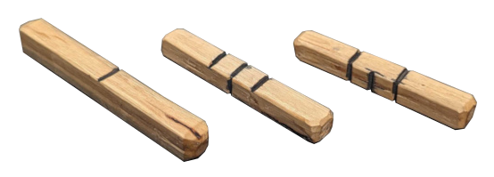

# EMBER 3E

**MBR: Makeshift Basic RPG**

**A Solo RPG for Emergencies**

### Why this RPG exists

For many years, I've been learning to live off the land.  One thing that was in the back of my mind for a long time was, "How do I keep myself entertained?" Then I noticed while watching the TV show, "Alone", that this was also an issue with the contestants. Boredom can be difficult to deal with.

As a solution to this, I decided to design a solo RPG with rules simple enough to memorize, does not need any information written down, and used some type of "oracle" to aid in story creation. I also made sure to include rules for relationships to help with feelings of loneliness.

This is that RPG. It's not for everyone and it's not designed to replace an RPG you might play in the comfort of your home. It's designed to be a form of entertainment that you can create with nothing but sticks and stones. (and a knife, though you could use a stone knife)

## The Dice

Ember uses a single long **d4** die. (Singular of "dice") AKA: Stick die. It is cut from a stick with straight edges and a square cross section. Leave one side blank, then cut **1**, **3**, and **2** notches, in that order, on the other sides. Each notch will wrap around **2** sides and opposite sides will add up to **3**.

Each number of the die has a meaning, is connected to one of the **4** elements, and represents one of your **4** stats. By itself, a single die can act as a simple oracle that you roll to describe a situation or person.

**0** is Earth, your constitution (**CON**), The smooth surface is the face of a stone, your foundation. This means your past or family. Someone with a down to earth personality. They will likely help you out of a sense of responsibility.

**1** is water, your strength (**STR**), the single line is a river or a friend who stands with you. Someone with an outgoing personality. They will likely help because they like you.

**2** is wind, your dexterity (**DEX**), the two lines showing the blowing air. It's also two lovers, someone who's passionate, loving, and caring, but maybe not to you. Possibly a pacifist. They will likely NOT help you because you're not the one they care most about.

**3** is fire, your mind and magic (**INT**), the lines showing the tips of a flame. It's also a group of people, an army or mob, representing a danger. They will not help you, and may even try to sabotage your efforts.

## Rolling

Roll the die **3** times and add the results. You then add to the results any relevant **stats** or **backgrounds** as explained later. If the result is equal to or greater than **10**, you succeed.

<!-- div style="page-break-before: always;"/ -->
No bonus added to the roll can be less than **0** or greater than **9**. This means there's always the chance of a failure, even with a **+9** to the roll.  (If you roll a **0**)

If you roll doubles, something changes about the current situation. If you roll triples, it's a major plot twist. Whether the change is good or bad depends on the outcome of the roll.

**Optional Rule**

Optionally, never add more than **8** to a roll. Limiting your bonus to an **8** will give you a **1** in **16** chance of failure vs a **1** in **64** chance of failure when adding **9**.

## A note about numbers

A **+5** bonus has a **50%** chance of success. Everything else is relative to this.

A roll of **0**, is always a failure. The range of **3** to **7** are fairly evenly distributed. Numbers outside this range are unlikely to be rolled, making smaller values too difficult and larger values to easy.

## Stats (CON, STR, DEX, INT)

Your character has **20** stat points, **5** for each of the **4** stats indicated by the die: **CON**, **STR**, **DEX**, and **INT**. You may distribute the points as you wish between the stats, but each stat must have no less than **3** points and no more than **7** points. If the points are evenly distributed, there's a **50%** chance of a success on all rolls using only the stats. (Beast-kin do have an exception to this rule, see below)

You get **HP** tokens equal to **5** plus your **CON**. Any damage you take will be subtracted from your **HP**.

Your character will also start with one **background** which is applied contextually. The **background** usually adds **+1** to a relevant roll that uses that **background** but can add **+2** for a highly specific **background**.

For example, a thief is a general **background** that can pick locks, sneak in shadows, climb walls, etc. so they add **+1** when picking locks. But a locksmith is a specific **background** that can only used when picking locks, so they would add **+2** when picking locks. If you have multiple relevant backgrounds, (as described later) you may add up to **+2**, but no more.

Use the stats in a way that makes sense. For example, if you're trying to talk someone into giving you a deal using:

* Your good looks, roll **+CON**
* Intimidation, roll **+STR**
* Slight of hand, roll **+DEX**
* Bargaining, roll **+INT**

## Temporary Bonuses

If the situation gives you an advantage or disadvantage during play, then add or subtract **1** from your final score.

For example, if you succeed in causing a distraction in order to sneak away in the chaos, then you should get a **+1** bonus while sneaking. If you fail at the distraction, you should get a **-1** to your score because you drew attention to yourself and put the guards on alert.

## Weapons and Items

Weapons and items can act like additional backgrounds. Some items may have special abilities, like a good luck charm as described next.

## Luck Tokens (replace a dice roll with luck)

Every impactful failed roll gives you a **luck** token. You can replace any roll, excluding any progress related rolls, with your total **luck** tokens. If you do, reset your tokens back to **0**. You cannot accumulate more than **9** **luck** tokens.

If you spend your luck, envision how your luck changed your situation to your benefit.

If your character has a "lucky" **background**, or has a lucky charm, then, after spending your **luck** tokens, you would reset your **luck** tokens to a predefined value, likely **1** or **2**. This means you will build up your **luck** faster the more lucky you are.

## Progress Tracks & Add Progress Roll (dice + PS)

When you have some task or goal you need to make progress towards, you will create a progress track. Whenever you do something to advance the progress of the task, you will decide on the *Progress Speed* (**PS**) you just made. This indicates how quickly or likely you are to add progress from the action you just took. You then make a *Add Progress Roll* by rolling **+PS**. If you succeed, add **+1** point to the progress. The **PS** should not be lower than **3**, but it can be as high as **9**. For every **2** points over **10** on your *Add Progress Roll* you add another **+1** point of progress. This means an easy task with an **PS** of **9** could add up to **5** points of progress in a single roll.

For example: You have a progress track for finding the Sword of MacGuffin. You hear rumors of the sword's location and roll **+5** on an *Add Progress Roll*. Later, after some oracle rolls, you find a map to the sword's exact location. Since this is a huge progress, you roll **+7** on an *Add Progress Roll*. On this second roll, you roll a **7** and add your **+7** bonus for a total of **14**. You then add **3** points to your progress: **1** point for a successful roll, (**10** or greater) plus another **2** points for rolling **4** over the target of **10**.

You cannot make more than **9** progress.

You cannot use **luck** to add progress, though a failed roll will give you a **luck** token.

Once you feel that your progress is high enough, you will make a *Finish Progress Roll*.

## Finish Progress Roll (dice + progress)

On a *Finish Progress Roll*, you add your current progress to the dice instead of a stat or background. If you fail the roll, you subtract the difference from your progress.  For example, if you have **5** progress, and you roll a **3**, for a total of **8**, then you fail the roll and subtract **2** (**10** - **8**) from your progress, bringing it down to **3**. If you fail a roll, you need to make at least **1** more point towards your progress before you can make another progress roll.

It is possible that the progress will end before a "Finish Progress Roll." For example, if an enemy runs away, the progress simply ends. If the enemy attacks again from an ambush, the progress would continue from the same value.

You cannot use **luck** on a progress roll, though a failed roll will give a **luck** token.

## Clocks

To start a clock, create a pile of tokens representing the clock. Every time you make an "Add Progress Roll", remove a token from the clock. Once you remove the last token, you are forced to make a "Finish Progress Roll." If you succeed, consider it a mixed result, since it was forced.

For example: The guards have left a door, and you're trying to pick the lock. The lock as an **PS** of **7**. You give yourself a clock with **4** tokens. On your **4th** roll, the clock runs out and you have **7** progress filled. You make a progress roll and succeed. But since the clock ran out, you succeeded in picking the lock, but the guards have returned and see you enter the room.

A good rule of thumb: For challenges that are an **PS** of **6** or higher, you generally want the clock tokens plus the **PS** to equal around **11**. You can add or subtract **1** token to remove or add tension to the situation.

## Combat

Combat is tracked as progress against an enemy. The **PS** of the progress represents how easy it is to defeat the enemy. Each time you land an attack on an enemy, you make an "Add Progress Roll".  Large groups of enemies can use a single progress track.

After each attack, weather it's successful or not, you will then roll for the enemy to attack you, if they're able.

Melee attacks roll **+STR** (powerful strikes)

Ranged attacks roll **+INT** (skillful strikes)

Dodge an attack roll **+DEX** (dodge strikes)

When you roll on an attack, for every **2** points you roll over **10**, you make an additional "Add Progress Roll."

If you fail to dodge an attack, you lose **1 HP**. If any attack drops your **HP** to **0**, you need to make a saving roll **+CON**. If you fail, you die. If you succeed, you remain at **0** and must make another saving roll every time you take damage. (You cannot have less than 0 HP)

While in combat, any action can result in an attack from an enemy. Taking a healing potion or running away gives the enemy a change to strike. Every turn of combat allows for one action by the PC and one reaction by the enemy. If you're playing with multiple PCs or enemies, they each get an action if it makes sense for them to. Large groups of enemies may attack as a single unit.

## VS Roll

If you're making a roll where two characters are using stats against each other, for example, one character trying to restrain another using **STR**, roll on both stats and the winner is the one with the highest final value. Backgrounds, of course, can be added. So a character with a "Wrestler" background would get a **+1** or maybe **+2** (since this is a specific skill) to actions around restraining or breaking a restraint.

On a tie, the winner is the one with the highest bonus, or things stay as they are. If that doesn't make sense in the fiction, roll again until there's a clear winner.

You could do all combat using VS rolls, (**STR** vs **DEX**, etc) but that would mean each enemy would need their own stats. This makes for richer combat but would require additional information and tracking of **HP** and other stats.

## Magic (If your world allows it)

When you cast magic, you imagine the effect you're trying to accomplish, within your skills, and roll **+INT**. If the magic can scale up, then for every **2** points you roll over **10**, you do an additional level of effect.

Magic is typically a background, though it can come from an item.  ie: A background of "Fire Mage" would give a **+1** to all fire spells, but a background or wand of "Fire Ball" would give a **+2** to the "Fire Ball" spell specifically.

## Golums, Constructs, and other Pets

Without a background specifically about pets, each PC can have one pet appropriate to their race and abilities. Roll **+INT** for creating or taming a pet.

## Rests & Healing

Between combats, you take a short rest and recover **50%** of your lost **HP**, rounded down. If you have healing magic, you can use it during a rest. Healing spells work by rolling **+INT** to see if it succeeds. If it does, it acts like a second rest. For every **+2** over **10** you roll, you heal an extra **1** point of **HP**.

For example, your team has a fighter and a healer. The fighter looses **9 HP** after a battle. They take a rest, and recover **4 HP**. The healer then uses their healing magic, adding **+1** for their background and **+6 INT** to their roll.  They roll a **5** + **1** + **6** for a total of **12** and the spell succeeds. They recover **50%** of the remaining **5 HP** lost, (**2**) plus an extra **1 HP** for rolling **2** over **10**, healing a total of **3** more **HP**. The fighter is now only down **2 HP** from before the battle.

If you take a long rest, a night passes, you heal **100%** of your **HP** and your **luck** is reset.

## Leveling

You do not gain stats by leveling. If you wish, you may gain weapons at the end of an adventure that act like a background.

Additional backgrounds can be learned after going on an adventure to get the resources needed to learn a new skill.

## Inventory

Ember uses a "**quantum inventory**". It is assumed your PC is more knowledgeable on what they should bring on a trip than you are. Because of that, the player doesn't know what the PC has until it is needed. When an item is needed, you either assume the PC has the item, or roll to see if the PC had the foresight to bring the item.

For example, you can assume your PC has rope, so you don't need to roll for it. They probably brought extra climbing equipment, so you might roll with **+7**. They probably didn't bring pitons and a hammer, but it's possible, so you might roll with a **+4**.

Similarly, you can roll to see if an item they have is the right item, such as if a key they found opens a specific door or chest.

## Relationships

There are **4** relationship types, matching the **4** sides of the die:

* Family
* Friend
* Romantic
* Enemy

There are also **4** levels for each relationship type:

| Level | Description                   |
|-------|-------------------------------|
| 0     | Casual knowledge of           |
| 1     | Personal knowledge of         |
| 2     | Spends time together          |
| 3     | Spends intimate time together |

Examples for each:

| Type     | 0                  | 1                        | 2                | 3                              |
|----------|--------------------|--------------------------|------------------|--------------------------------|
| Family   | Cousin             | Grandparent              | Parent           | Sibling                        |
| Friendly | Know Their Name    | Know Personal Information| Hang Out Together| Self Sacrificing Friendship    |
| Romantic | Flirting           | Dating                   | Engaged          |                         Married|
| Enemy    | Part Of Enemy Team | Known Enemy Member       | Personal Enemy   | Actively Trying To Kill        |

Your relationship to others is recorded as:

* The relationship type
* The relationship level
* The progress to the next level

For example, if you're dating someone and have made significant progress towards asking them to marry you, you could record this as:

(**2**) (**1**) (**5**)

(**2**: romantic) (**1**: dating) (**5** progress towards being engaged)

These numbers would be recorded on that npc's stats. (They record their relationship with you)

## Recording Stats

Since all stats have a specific order and value, they can be recorded as notches on a stick, knots in a rope, or any other convenient way to record a list of numbers. I prefer knots and use a figure 8 knot to represent a **0** value, single overhand knots for a **1** value, and a double overhand knot for a **5** value in roman numeral notation. I personally like to record stats in this order:

**Description:** (Always first. Especially useful for NPCs)

* Size (abstract, relative number)
* Gender (0: Manly Man, 1: Male, 2: Female, 3: Girly Girl)
* Race (See races)

The description order is the order a character would be described. ie: "short girly female human" (1, 3, 1) or "tall male dwarf". (3, 1, 0)

**Personal quest progress:**

* Level
* Progress

**Relationship to PC:** (NPCs only. May have multiple sets)

* Type
* Level
* Progress

**Stats:** (The only grouping with 4 values)

* **CON**
* **STR**
* **DEX**
* **INT**

**HP and Luck:** (They change the most so are listed last)

* **HP**
* **Luck**

These values could be recorded on lengths of string or rope, each tied in a row on a stick or another piece of string.

You can tell the different sets apart by their position and length. The description is always the first set, any personal quests have **2** values, the relationships have **3** values, stats have **4** values. If a character is a changeling, (see beast-kin below) there will be **2** sets of stats, with their default form first and their secondary form second. **HP** and **luck** are at the end.

Backgrounds cannot be easily recorded, which is why each PC starts with only **1** background and must put effort into gaining additional backgrounds. If you want, you could carve a symbol or object in wood to represent a character's background. For example, a sword for a fighter, a book for a magic user, or a key for a thief. This can be carved on a stick and tied to the rope.  This also works for personal quests.

## Probabilities

Probability of a successful roll for each add to the roll

|         | Success Percent |
|---------|--------|
| **+1**  | 01.56% |
| **2**   | 06.25% |
| **3**   | 15.62% |
| **4**   | 31.25% |
| **5**   | 50.00% |
| **6**   | 68.75% |
| **7**   | 84.37% |
| **8**   | 93.75% |
| **9**   | 98.44% |

**Chance of rolling triples:** 6.25%

Probability of adding to progress per **PS**

|          |  +1    |  +2    |  +3    |  +4    | +5    |
|----------|--------|--------|--------|--------|-------|
|  **PS 9**| 14.06% | 34.38% | 34.37% | 14.07% | 1.56% |
|  **8**   | 25.00% | 37.50% | 25.00% | 6.25   | 0%    |
|  **7**   | 34.38% | 34.37% | 14.07% | 1.56   | 0%    |
|  **6**   | 37.50% | 25.00% | 6.25   | 0%     | 0%    |
|  **5**   | 34.37% | 14.07% | 1.56   | 0%     | 0%    |
|  **4**   | 25.00% | 6.25%  | 0%     | 0%     | 0%    |
|  **3**   | 14.07% | 1.56%  | 0%     | 0%     | 0%    |

Average number of rolls to reach a certain progress per **PS**

|          | Prog 3 |  4   |  5   |  6   |  7   |  8   |  9   |
|----------|--------|------|------|------|------|------|------|
|  **PS 9**| 1.2    | 1.6  | 2.0  | 2.4  | 2.8  | 3.2  | 3.6  |
|  **8**   | 1.5    | 2.0  | 2.5  | 3.0  | 3.5  | 4.0  | 4.5  |
|  **7**   | 2.0    | 2.6  | 3.3  | 4.0  | 4.6  | 5.3  | 5.9  |
|  **6**   | 2.8    | 3.8  | 4.7  | 5.6  | 6.6  | 7.5  | 8.5  |
|  **5**   | 4.5    | 6.0  | 7.4  | 8.9  | 10.4 | 11.9 | 13.4 |
|  **4**   | 8.0    | 10.7 | 13.3 | 16.0 | 18.7 | 21.3 | 24.0 |
|  **3**   | 17.5   | 23.3 | 29.1 | 34.9 | 40.7 | 46.5 | 52.4 |

## Additional oracles

You can use these tables, or you make a 4x4 grid and draw images or single words into each box. Try to make the words or icons generic enough to have multiple generic meanings. Oracles are hints at what needs to be done and can have multiple meanings. For example, "Follow + Trap" could mean:

* Find someone by following the trail of traps they laid out to protect their hideout
* Follow some instructions on building or placing traps
* Follow a person and lay a trap for them for when they return
* Follow a map to a treasure, but watch out for traps
* Follow a person, but unknown to your character, you're being led into a trap

Table 1, an action to perform

| Action | 0           | 1       | 2       | 3        |
|--------|-------------|---------|---------|----------|
| **0**  | Protect     | Deliver | Follow  | Suppress |
| **1**  | Consume     | Assist  | Escalate| Challenge|
| **2**  | Transform   | Locate  | Forgive | Avenge   |
| **3**  | Investigate | Control | Abandon | Defeat   |

Table 2, the subject of the action

| Subject | 0         | 1         | 2           | 3         |
|---------|-----------|-----------|-------------|-----------|
| **0**   | Family    | Safety    | Truth       | Debris    |
| **1**   | Prediction| Friend    | Leader      | Corruption|
| **2**   | Freedom   | Love      | Relationship| Trap      |
| **3**   | Resource  | Deception | Defense     | Enemy     |

# Setting

While the rules are designed to be setting neutral, I did create a high fantasy setting with magic and races that I'll explain here if you want to use it.

## Races

Ember has 4 races, each represented by one of the elements. Each race has their own type of magic they're capable of. If using a racial magic without a background, roll on **+INT** without any other bonus.

#### Dwarf (Earth)

Dwarfs are masters of stone. They mine the Earth and work the metal into shape using the other elements. Fire to heat it, wind to stoke the fire, and water to quench the metal. Dwarfs are tough like stone and have a strong connection to their families and their past.

Elemental (earth, water, wind, fire) magic. Durable elemental enhanced weapons. Clay golums.

#### Human (Water)

Humans are masters of energy. They live on the Earth and use the strength of rivers to power their machinery.

Electrical magic. Electronics. Robotic constructs. Complex mechanical traps. Complex weapons such as firearms, crossbows, etc. All humans can power electrical devices with magic, or anything that requires a spark.

#### Elf (Wind)

Elves are masters of nature. They live in the trees, they're light and fast, able to jump from branch to branch. Their relationships tend to be fast and fleeting.

Nature and spiritual magic. Potions. Healing magic. Plant golems. Sentient / living weapons.

#### Beast-Kin (Fire)

Beast-Kin are masters of the body. They are half animal and can change fully into their animal shapes. They are more feral than the other races, which can make them dangerous when their instincts take over.

Transformation, healing, and boosting magic, but only on themselves. All beast-kin have some understanding of other animals' instincts, can fully communicate with the same type of animal as their animal form, and can transform into their one associated animal (a cat girl can change into a cat) but they need a background to change into other animals, and need to roll for success. (For example, a cat girl that can change into a bird)

Their animal form will have its own stats. For example, a **5 3 3 9** bear-kin mage may change their stats to **8 7 4 1** when transformed into a bear.

Transformations into their base animal form always succeed and take **1** full turn. An enemy may attack during this time and if successful, will harm both forms. When rolling to avoid damage, use the **+DEX** from the form with the lowest value.

Each form has their own instance of **HP** and **luck**. They are played like two separate entities. If one form drops to **0 HP**, they transform into their other form automatically and cannot change back until healed. Short rests and external healing only heals the current form. Long rests and self healing magic heal both forms an equal amount.

A beast-kin's animal form can exceed their human form's limits. This means the lower limit is dropped to **1** and the upper limit is raised to **9**. Most often this means **INT** is dropped to **1** while one other stat is raised to **9**. A cat, for example, might have the stats **7 3 9 1**. Showing a cat's very high **DEX**, and very low **INT**.

Other races that can transform, like a half-pixie that changes between human and pixie forms, would be played as a beast-kin.

If a beast-kin cannot transform, then their stats would be recorded without a second stat block, representing that they only have one form.