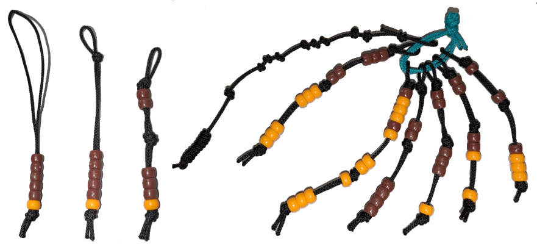
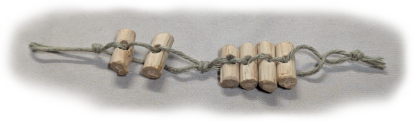

# Tracker Beads

To track changing values, you can create tracker beads as shown below.

After you find the beads you want to use, find a string or cordage that, when folded in half, the bead will fit tightly, unable to move unless moved by force.

The utility cord I use in the photos is **16** inches long, or **8** inches when folded in half. You'll need a lot more than you think. Even an overhand knot will eat up a lot more length than you'd think.

With the first tracker I made, I kept all the knots loose to start, then tightened them starting at the top loop and working down, figuring out the gaps that felt right to me. By the end, I had what felt like the perfect length to me. I then measured the excess and reduced the amount of cord to use on the remaining trackers by that amount. (measured when folded in half)

It should be clear from the photo how to make the trackers. What might not be clear is how I use them to count. I use them them like a Soroban, or an abacus.  The bottom beads have a value of **1** and the top beads have a value of **5**. If a bead is part of the group touching the center, then it's counted.

I also used colored beads to help me quickly identify which tracker represents what.  The **4** traits, numbered **0** to **3**, are on the right side, with **0** to **3** lighter colored beads. To the left of the **CON** tracker, is the **HP**.  I added more beads on there so it would still be useful at higher levels.  Also, I could use it for counting other things not game related if needed. I used a darker bead for the **20** and **40** values to more quickly count the **5**s.

To the left of those is a tracker for keeping track of enemies. The bottom beads, the same color as the HP beads, is the enemy **HP** / **LVL**.  The darker beads above them track the number of enemies remaining.  In this example, there are **2** level **3** enemies.

On the far left is my character stats. It's a **2** foot length of cord with double overhand knots representing the **5**s and single overhand knots representing the **1**s. Though it may be hard to see, this cord shows: **5**+**5**, **1**+**1**+**1**, **1**+**1**+**1**, **5** which is my level **1** character with **10 CON**, **3 STR**, **3 DEX**, and **5 INT**. The end of the cord is folded over, looped tight around itself, then the end is tucked through the loop formed and pulled it somewhat tight. Similar to tying a noose. I figured out the correct length by tying the knots for a **12 12 4 4** character, giving me **4** double overhand and **12** single overhand knots. This can be done before cutting the cord.

If your string is too small for your beads or you want to make beads from wood, as shown below, you can feed the string in from the sides. This creates enough resistance to hold the beads in place. FYI, the holes in the wood beads below were drilled with the reamer blade in my Swiss army (Victorinox) knife. I went most of my life without realizing that blade could be used to drill holes. Now you know.

